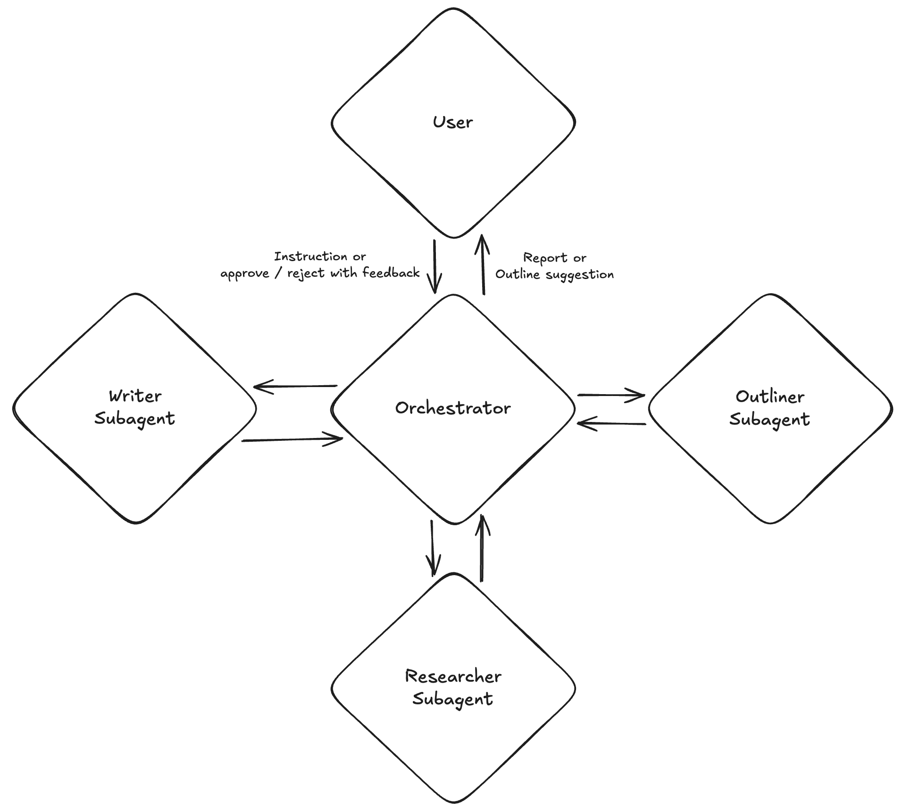

## Orchestrator Agent 아키텍처 및 Flow



### 개요

Orchestrator Agent는 **전체 리포트 생성 워크플로우를 관리하고 조율하는 최상위 에이전트**입니다. Outliner, Researcher, Writer 세 개의 Subagent를 순차적으로 호출하고, 각 Subagent 간의 데이터 흐름을 관리하며, 전체 프로세스의 상태를 추적합니다.

이 에이전트의 핵심 특징은 **허브-앤-스포크(Hub-and-Spoke) 방식의 중앙 집중식 워크플로우 제어**와 **Human-in-the-loop을 통한 초기 단계 사용자 개입**입니다.

---

### 역할과 책임

#### 1. 워크플로우 관리 (Workflow Management)

Orchestrator는 리포트 생성의 전체 파이프라인을 제어합니다. PNG 아키텍처와 같이 Orchestrator가 허브(Hub) 역할을 하며, 모든 Subagent와 사용자와의 통신이 Orchestrator를 통해 이루어집니다:

```
                        User
                          │
          Instruction or approve/reject with feedback
                          │
                          ▼
                   ┌─ Orchestrator ─┐
                  /        │        \
                 /         │         \
    Outliner Subagent  Researcher  Writer Subagent
                        Subagent
```

각 단계에서 이전 Subagent의 출력을 다음 Subagent의 입력으로 전달하고, 전체 프로세스가 완료될 때까지 흐름을 관리합니다.

#### 2. Subagent 조율 (Subagent Coordination)

Orchestrator는 세 개의 Subagent를 조율합니다:

- **Outliner Subagent 호출**: 사용자 입력을 전달하고 아웃라인을 수신
- **Researcher Subagent 호출**: 아웃라인을 전달하고 섹션별 수집된 정보를 수신
- **Writer Subagent 호출**: 섹션별 정보를 전달하고 최종 리포트를 수신

각 Subagent는 독립적으로 동작하며, Orchestrator가 이들 간의 인터페이스 역할을 합니다.

#### 3. 상태 관리 (State Management)

Orchestrator는 전체 워크플로우의 상태를 추적합니다:

- 현재 어느 단계에 있는지
- 각 Subagent의 출력물 (아웃라인, 수집된 정보, 작성된 섹션 등)
- 에러 발생 시 복구 지점
- Human-in-the-loop 대기 상태

---

### 처리 단계

#### Step 1: 사용자 입력 수신

사용자로부터 리포트 주제 또는 질문을 **Instruction or approve/reject with feedback** 형태로 입력받습니다.

#### Step 2: 사용자 의도 파악 (Human-in-the-loop #1)

사용자의 입력이 모호하거나 추가 정보가 필요한 경우, Orchestrator가 **사용자에게 clarifying question을 통해 의도를 명확히 파악**합니다.

#### Step 3: Outliner Subagent 호출

명확해진 사용자 입력을 Outliner Subagent에 전달하여 아웃라인을 생성합니다.

#### Step 4: 아웃라인 승인 (Human-in-the-loop #2)

생성된 아웃라인을 **사용자에게 Report or Outline suggestion 형태로 보여주고 승인을 요청**합니다. 사용자가 수정을 요청하면 피드백을 반영하여 아웃라인을 재생성합니다.

#### Step 5: Researcher Subagent 호출

승인된 아웃라인을 Researcher Subagent에 전달하여 섹션별 정보를 수집합니다.

#### Step 6: Writer Subagent 호출

섹션별 수집된 정보를 Writer Subagent에 전달하여 리포트를 작성합니다.

#### Step 7: 최종 리포트 전달

완성된 리포트를 사용자에게 **Report or Outline suggestion** 형태로 전달합니다.

---

### Human-in-the-loop

Orchestrator는 **워크플로우 초기 단계에서 두 가지 사용자 개입 지점**을 제공합니다. 이는 잘못된 방향으로 리포트가 작성되는 것을 방지하기 위함입니다.

사용자와 Orchestrator 간의 통신 방향:
- **User → Orchestrator**: Instruction or approve/reject with feedback
- **Orchestrator → User**: Report or Outline suggestion

#### HITL #1: 사용자 의도 파악

사용자의 초기 입력만으로는 정확한 리포트를 작성하기 어려운 경우, Orchestrator가 추가 질문을 통해 의도를 명확히 합니다.

```
User: "AI에 대한 리포트 작성해줘"
    ↓ (Instruction)
Orchestrator 판단: "주제가 너무 광범위함"
    ↓
Orchestrator → User: "어떤 측면의 AI를 다루길 원하시나요?
                      (예: 시장 동향, 기술 트렌드, 특정 산업 적용 등)
                      타겟 독자는 누구인가요?
                      원하는 분량이 있나요?"
    ↓ (Report or Outline suggestion)
User: "생성형 AI 시장 동향, 투자자 대상, 10페이지 내외"
    ↓ (Instruction or approve/reject with feedback)
Orchestrator: 명확해진 요구사항으로 Outliner Subagent 호출
```

의도 파악 시 확인할 수 있는 항목:
- 주제의 구체적 범위
- 타겟 독자
- 원하는 분량/깊이
- 특별히 포함하거나 제외할 내용
- 톤앤매너 선호

#### HITL #2: 아웃라인 승인

Outliner Subagent가 생성한 아웃라인을 사용자가 확인하고 승인합니다. 아웃라인은 전체 리포트의 뼈대가 되므로, 이 단계에서 방향을 잡는 것이 중요합니다.

```
Outliner Subagent → 아웃라인 생성 완료
    ↓
Orchestrator → User: "다음과 같은 아웃라인으로 리포트를 작성하려 합니다:
                      1. 서론: 생성형 AI 시장 개요
                      2. 시장 규모 및 성장 전망
                      3. 주요 플레이어 분석
                      4. 기술 트렌드
                      5. 투자 시사점
                      6. 결론

                      진행해도 될까요?"
    ↓ (Report or Outline suggestion)
User 선택:
    - "승인" → Researcher Subagent 진행
    - "수정 요청": "규제 관련 섹션 추가해줘" → Outliner Subagent 재실행
    ↓ (approve/reject with feedback)
```

아웃라인 단계에서 사용자 승인을 받는 이유:
- 아웃라인이 확정되면 이후 리서치와 작성이 이 구조를 따름
- 잘못된 아웃라인으로 진행하면 전체 작업을 다시 해야 함
- 초기에 방향을 잡는 것이 비용 효율적

---

### 전체 워크플로우

```
                              User
                               │
          ┌────────────────────┴────────────────────┐
          │  Instruction or approve/reject           │
          │  with feedback                           │  Report or
          ▼                                          │  Outline suggestion
   ┌─────────────────────────────────────────────────────────────────────┐
   │  Orchestrator (Hub)                                                  │
   │                                                                      │
   │  1. 사용자 입력 수신 (Instruction)                                    │
   │      ↓                                                               │
   │  2. [HITL #1] 사용자 의도 파악 (필요시 clarifying questions)          │
   │      ↓                                                               │
   │  3. Outliner Subagent 호출 ←───────────────────────────────┐        │
   │      ↓                                                      │        │
   │  4. [HITL #2] 아웃라인 사용자 승인 ──(수정 요청)─────────────┘        │
   │      ↓ (승인)                                                        │
   │  5. Researcher Subagent 호출                                         │
   │      ↓                                                               │
   │  6. Writer Subagent 호출                                             │
   │      ↓                                                               │
   │  7. 최종 리포트 반환 (Report)                                         │
   │                                                                      │
   └─────────────────────────────────────────────────────────────────────┘
          │
          ▼ Report or Outline suggestion
        User
```

허브-앤-스포크 구조에서 각 Subagent는 Orchestrator를 통해서만 통신합니다:

```
                    ┌─────────────────────┐
                    │       User          │
                    └─────────┬───────────┘
                              │ ↕
                    ┌─────────▼───────────┐
                    │    Orchestrator     │
                    └──┬──────┬───────┬──┘
                       │ ↕    │ ↕     │ ↕
            ┌──────────▼─┐ ┌──▼──────┐ ┌▼───────────┐
            │  Outliner  │ │Research-│ │   Writer   │
            │  Subagent  │ │   er    │ │  Subagent  │
            └────────────┘ │Subagent │ └────────────┘
                           └─────────┘
```

---

### 에러 처리 및 복구

Orchestrator는 워크플로우 중 발생할 수 있는 에러를 처리합니다:

**1. Subagent 실패 처리**
- 특정 Subagent가 최대 반복 횟수에 도달해도 품질 기준을 충족하지 못하면, Orchestrator가 사용자에게 알리고 선택지를 제공합니다.
- 선택지: 현재 결과로 진행, 해당 단계 재시도, 워크플로우 중단

**2. 부분 복구**
- 워크플로우 중간에 실패가 발생하면, Orchestrator가 마지막 성공 상태부터 재시작할 수 있습니다.
- 예: Writer Subagent 실패 시, Researcher 결과를 유지한 채 Writer만 재실행

**3. 상태 저장**
- 긴 워크플로우의 경우, 각 단계의 결과를 저장하여 나중에 이어서 진행할 수 있습니다.

---

### 구현 시 핵심 컴포넌트

1. **WorkflowEngine**: 전체 워크플로우의 단계를 정의하고 순차 실행을 관리
2. **StateManager**: 현재 워크플로우 상태, 각 Subagent의 출력물, 에러 상태 등을 저장 및 관리
3. **SubagentInterface**: 각 Subagent와의 통신을 추상화한 인터페이스
4. **IntentClarifier**: 사용자 의도 파악을 위한 clarifying question 생성 및 응답 처리
5. **ErrorHandler**: 에러 발생 시 복구 전략을 결정하고 실행
6. **OrchestratorAgent**: 위 컴포넌트들을 조합하여 전체 워크플로우를 orchestration

---

### Orchestrator vs Subagents 역할 비교

| 구분 | Orchestrator | Subagents (Outliner/Researcher/Writer) |
|------|--------------|----------------------------------------|
| 역할 | 전체 워크플로우 제어 | 특정 태스크 수행 |
| 범위 | 시스템 전체 | 자신의 파이프라인 내부 |
| 상태 관리 | 전체 워크플로우 상태 | 자신의 내부 상태만 |
| 사용자 상호작용 | HITL 관리 (의도 파악, 아웃라인 승인) | 없음 (Orchestrator를 통해서만) |
| Evaluator | 없음 (Subagent의 Evaluator에 위임) | 내부 Evaluator 보유 |
| 에러 처리 | 전체 워크플로우 레벨 복구 | 자신의 파이프라인 내 재시도 |
