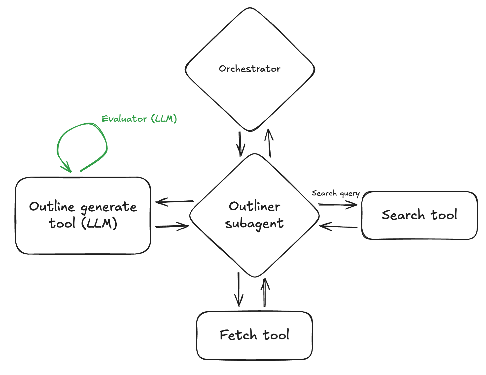

## Outliner Subagent 아키텍처 및 Flow



### 개요

Outliner Subagent는 Orchestrator로부터 리포트 주제를 입력받아 **체계적인 목차(Outline)를 생성**하는 서브에이전트입니다. 단순히 LLM에게 목차를 요청하는 것이 아니라, Search tool로 실제 정보를 검색하고, Fetch tool로 웹페이지 전체 콘텐츠를 수집한 뒤, Outline generate tool(LLM)을 통해 현실적이고 내용이 풍부한 아웃라인을 생성합니다.

이 서브에이전트의 핵심 특징은 **Outline generate tool 내부에 Evaluator(LLM)가 자기 루프(self-loop) 형태로 내장**되어, 아웃라인의 품질을 반복적으로 검증하고 개선한다는 점입니다.

---

### 처리 단계

#### Step 1: 입력 수신 (Orchestrator → Outliner Subagent)

Orchestrator로부터 리포트 주제 또는 질문을 입력받습니다. 예를 들어 "2024년 생성형 AI 시장 동향 분석"과 같은 형태입니다.

#### Step 2: 웹 검색 (Search tool)

Outliner Subagent가 **Search tool을 호출**하여 입력 주제에 관련된 검색 쿼리를 전송합니다. Search tool은 검색 결과(스니펫)를 반환하고, Outliner Subagent는 이를 수신합니다.

- Outliner Subagent → Search tool: 검색 쿼리(Search query) 전송
- Search tool → Outliner Subagent: 검색 결과 스니펫 반환
- 필요에 따라 다양한 관점의 쿼리를 여러 번 호출 가능

#### Step 3: 웹페이지 콘텐츠 수집 (Fetch tool, 선택)

스니펫만으로 정보가 부족한 경우, Outliner Subagent가 **Fetch tool을 호출**하여 해당 웹페이지의 전체 콘텐츠를 가져옵니다.

- Outliner Subagent → Fetch tool: URL 전송
- Fetch tool → Outliner Subagent: 전체 웹페이지 콘텐츠 반환

#### Step 4: 아웃라인 생성 및 평가 (Outline generate tool + Evaluator 루프)

수집된 모든 정보를 종합하여 Outliner Subagent가 **Outline generate tool(LLM)을 호출**합니다. Outline generate tool 내부에는 **Evaluator(LLM)가 자기 루프(self-loop)** 형태로 내장되어 있어, 생성된 아웃라인의 품질을 자체적으로 평가하고 기준 미달 시 재생성을 반복합니다.

```
Outline generate tool 내부:
  아웃라인 생성
      ↓
  Evaluator(LLM) 평가
      ↓
  (통과) → 최종 아웃라인 반환
  (미달) → 피드백 반영 후 재생성 → Evaluator 재평가 (self-loop)
```

Evaluator 평가 항목 예시:
- 섹션 개수가 적정 범위 내인가 (예: 3~7개)
- 각 섹션의 description이 충분히 구체적인가
- 섹션 간 내용 중복이 없는가
- 논리적 흐름이 자연스러운가 (서론 → 본론 → 결론)
- 입력 주제와의 관련성이 높은가

#### Step 5: 결과 반환 (Outliner Subagent → Orchestrator)

Outline generate tool로부터 최종 아웃라인을 수신한 Outliner Subagent가 **Orchestrator에게 결과를 반환**합니다.

---

### 전체 Flow 요약

```
Orchestrator
    ↕
Outliner Subagent
    ├─→ Search tool (Search query) ─→ 검색 결과 반환
    ├─→ Fetch tool (URL) ─→ 전체 콘텐츠 반환 (선택)
    └─→ Outline generate tool (LLM)
            └─→ Evaluator (LLM) self-loop: 평가 → 재생성 반복
                    ↓ (품질 통과)
              최종 아웃라인 반환
```

---

### 종료 조건

다음 조건을 만족하면 최종 아웃라인을 Orchestrator에게 반환합니다:

1. Outline generate tool 내 Evaluator가 품질 기준 통과 판정
2. 또는, Evaluator 루프의 최대 반복 횟수 도달 (graceful degradation)

---

### 구현 시 핵심 컴포넌트

1. **Search tool**: 검색 쿼리를 받아 검색 스니펫을 반환 (Outliner Subagent가 호출)
2. **Fetch tool**: URL을 받아 웹페이지 전체 콘텐츠를 반환 (필요시 호출)
3. **Outline generate tool (LLM)**: 입력과 검색 결과를 받아 구조화된 아웃라인을 생성하는 LLM 도구
4. **Evaluator (LLM)**: Outline generate tool 내부의 자기 루프(self-loop) 컴포넌트로, 생성된 아웃라인의 품질을 평가하고 pass/fail 여부와 피드백을 반환
5. **Outliner Subagent**: Search tool, Fetch tool, Outline generate tool을 조합하여 전체 flow를 실행하고, Orchestrator와 입출력을 주고받는 서브에이전트

---

### 컴포넌트 역할 비교

| 구분 | Outliner Subagent | Outline generate tool (LLM) | Evaluator (LLM) |
|------|-------------------|-----------------------------|-----------------|
| 역할 | 도구 호출 및 전체 flow 조율 | 아웃라인 생성 | 아웃라인 품질 평가 |
| 작동 시점 | Orchestrator 지시 수신 후 전 단계 | 정보 수집 완료 후 | 아웃라인 생성 완료 후 (self-loop) |
| 판단 대상 | 어떤 도구를 호출할지, 정보가 충분한지 | 수집된 정보를 기반으로 구조화된 목차 작성 | 생성된 아웃라인이 품질 기준을 충족하는가 |
| 위치 | 서브에이전트 (diamond) | 외부 도구 (rounded rect) | Outline generate tool 내 self-loop |
| 구현 방식 | Agent 로직 (도구 호출 루프) | LLM call + Structured Output | LLM call (pass/fail + 피드백 메시지) |
