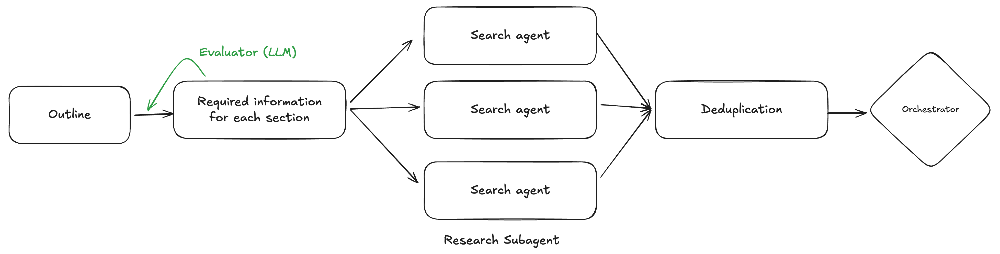
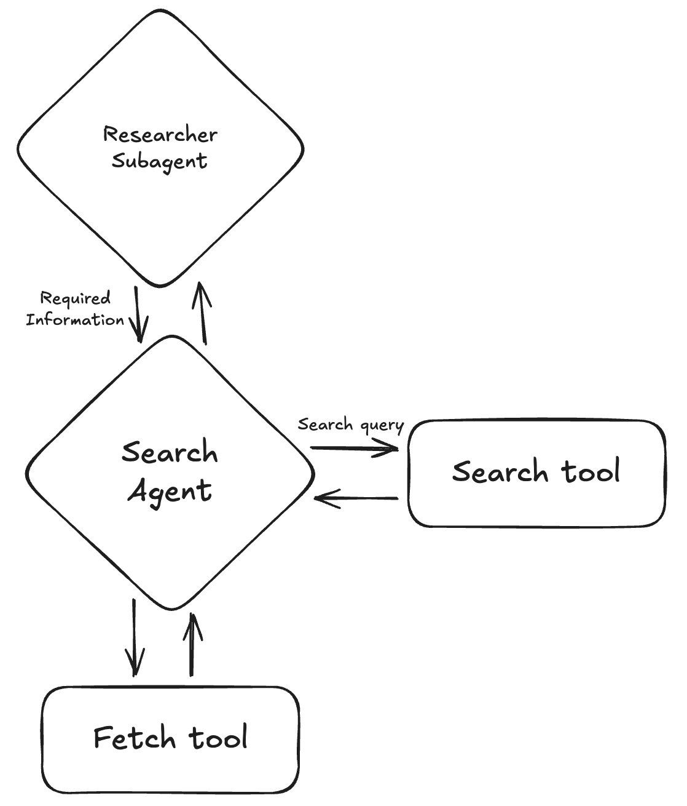

## Researcher Subagent 아키텍처 및 Flow





### 개요

Researcher Subagent는 **Outliner Agent가 생성한 아웃라인을 입력으로 받아**, 각 섹션을 작성하는 데 필요한 정보를 수집하는 서브에이전트입니다. 단순히 전체 주제에 대해 검색하는 것이 아니라, **섹션별로 필요한 정보를 정의하고 각각에 대해 독립적인 Search Agent를 병렬로 실행**합니다.

이 에이전트의 핵심 특징은 **섹션 단위의 병렬 Search Agent 실행**, **Evaluator 기반의 필요 정보 정의 루프**, 그리고 **중복 제거(Deduplication) 단계**를 통해 각 섹션에 필요한 정보를 빠짐없이, 중복 없이 수집한다는 점입니다.

---

### 전체 파이프라인

```
Outline
    ↓
Required Information 정의 (Evaluator 자기 루프)
    ↓
Search Agent 1 ─┐
Search Agent 2 ─┤  (병렬 실행)
Search Agent N ─┘
    ↓
Deduplication
    ↓
Orchestrator
```

---

### 처리 단계

#### Step 1: 아웃라인 수신

Outliner Agent(Orchestrator)로부터 완성된 아웃라인을 입력받습니다. 아웃라인에는 각 섹션의 제목, 설명, 그리고 해당 섹션에서 다룰 내용에 대한 정보가 포함되어 있습니다.

#### Step 2: 섹션별 필요 정보 정의 (Required Information Extraction)

아웃라인의 **각 섹션에 대해 "이 섹션을 작성하려면 어떤 정보가 필요한가?"를 정의**합니다. 이 단계에서 LLM을 활용하여 각 섹션의 description을 분석하고, 구체적으로 수집해야 할 정보 항목들을 도출합니다.

이 단계에는 **Evaluator(LLM) 자기 루프(self-loop)**가 존재합니다. 필요 정보가 충분하고 적절하게 정의되었는지 Evaluator가 평가하고, 미달인 경우 피드백을 반영하여 재정의합니다.

```
Required Information 정의
    ↓
Evaluator(LLM) 평가
    ↙           ↘
(미달)         (통과)
  ↓
피드백 반영하여 재정의 → 재평가
```

예시 - "생성형 AI 시장 동향" 아웃라인의 경우:
- 섹션 1 "시장 규모 현황" → 필요 정보: 글로벌 시장 규모 수치, 성장률, 주요 시장 조사 기관 리포트
- 섹션 2 "주요 플레이어 분석" → 필요 정보: OpenAI/Anthropic/Google 등 기업별 제품, 시장 점유율, 최근 발표
- 섹션 3 "기술 트렌드" → 필요 정보: 멀티모달, 에이전트, 소형 모델 등 최신 기술 동향
- 섹션 4 "규제 및 정책" → 필요 정보: EU AI Act, 각국 규제 현황, 기업 대응

Evaluator 평가 항목 예시 (필요 정보 정의):
- 필요 정보 항목이 충분히 구체적인가
- 해당 섹션의 description을 커버하는가
- 검색 가능한 형태로 정의되었는가
- 누락된 중요 항목이 없는가

#### Step 3: 섹션별 Search Agent 병렬 실행

각 섹션의 필요 정보를 **Researcher Subagent가 각 Search Agent에 전달**하고, **Search Agent들은 병렬로 독립 실행**됩니다. 각 Search Agent는 동일한 내부 구조를 가집니다.

#### Step 4: 중복 제거 (Deduplication)

모든 Search Agent가 완료되면, 수집된 결과를 **Deduplication 단계에서 정제**합니다. 여러 섹션 또는 여러 검색 쿼리에서 중복으로 수집된 문서, 스니펫, URL 등을 식별하여 제거합니다.

- 동일 URL의 중복 제거
- 내용이 유사한 스니펫 병합 또는 선택
- 섹션 간 중복 참조 정리

Deduplication이 완료된 결과는 **Orchestrator로 반환**됩니다.

---

### Search Agent 내부 구조

각 Search Agent는 **Researcher Subagent로부터 "Required Information"을 전달받아** 실제 검색과 콘텐츠 수집을 담당합니다. Search Agent는 Search tool과 Fetch tool을 반복적으로 활용하는 내부 루프 구조를 가집니다.

```
Researcher Subagent (Required Information 전달)
        ↕
   Search Agent
    ↙        ↘
Search tool  Fetch tool
(Search query)
```

**Search Agent의 내부 동작:**

1. **Search tool 활용**: 필요 정보를 바탕으로 검색 쿼리를 생성하고, Search tool로 웹 검색을 수행하여 스니펫을 수집합니다.

2. **Fetch tool 활용**: 스니펫만으로 정보가 부족하거나 상세 내용이 필요한 경우, Fetch tool로 해당 웹페이지의 전체 콘텐츠를 가져옵니다.

3. **반복 실행**: Search tool과 Fetch tool을 필요에 따라 반복하여 Required Information을 충족할 때까지 정보를 수집합니다.

예시 - 섹션 1 "시장 규모 현황"의 Search Agent:

```
Required Information: "글로벌 시장 규모 수치, 성장률, 주요 리포트"
    ↓
Search tool: "generative AI market size 2024" → 스니펫 수집
    ↓
Search tool: "AI market growth forecast 2025-2030" → 스니펫 보강
    ↓
Fetch tool: Gartner 리포트 페이지 전체 콘텐츠 수집
    ↓
섹션 1 리서치 완료
```

---

### 전체 Flow 다이어그램

```
Outline 입력
    │
    ▼
┌─────────────────────────────────────────────────────────┐
│  Required Information 정의 (Evaluator 자기 루프)          │
│                                                         │
│  Required Information 생성                               │
│      ↓                                                  │
│  Evaluator(LLM) 평가                                    │
│      ↓                                                  │
│  (미달) → 피드백 반영하여 재정의 → 재평가                 │
│      ↓ (통과)                                           │
└─────────────────────────────────────────────────────────┘
    │
    ├─→ Search Agent 1 [섹션 1 필요 정보]
    │       ↕ Search tool / Fetch tool
    │
    ├─→ Search Agent 2 [섹션 2 필요 정보]  (병렬 실행)
    │       ↕ Search tool / Fetch tool
    │
    └─→ Search Agent N [섹션 N 필요 정보]
            ↕ Search tool / Fetch tool
    │
    ▼
┌─────────────────────┐
│   Deduplication     │
│  (중복 제거 및 정제) │
└─────────────────────┘
    │
    ▼
Orchestrator (결과 반환)
```

---

### 병렬 처리의 이점

Researcher Subagent가 섹션별로 독립적인 Search Agent를 실행하는 구조는 다음과 같은 이점이 있습니다:

1. **효율성**: 각 섹션의 리서치가 병렬로 진행되어 전체 처리 시간이 단축됩니다.

2. **집중도**: 각 Search Agent가 해당 섹션에 필요한 정보만 집중적으로 수집하므로, 관련 없는 정보가 섞이지 않습니다.

3. **독립적 품질 관리**: 한 섹션의 정보 수집이 부족해도 다른 섹션에 영향을 주지 않으며, 해당 Search Agent만 추가 반복을 진행할 수 있습니다.

4. **확장성**: 아웃라인의 섹션 수가 늘어나도 병렬 처리로 대응 가능합니다.

---

### 종료 조건

다음 조건을 만족하면 리서치를 완료합니다:

1. 필요 정보 정의 Evaluator가 통과 판정
2. **모든 Search Agent가** 담당 섹션의 Required Information 수집 완료
3. Deduplication 완료
4. 또는, 각 단계의 최대 반복 횟수 도달 (graceful degradation)

---

### 구현 시 핵심 컴포넌트

1. **RequiredInfoExtractor**: 아웃라인의 각 섹션을 분석하여 필요한 정보 항목 리스트를 반환
2. **RequiredInfoEvaluator**: 정의된 필요 정보가 적절하고 충분한지 평가하는 **독립 컴포넌트** (자기 루프)
3. **SearchAgent**: 섹션별로 생성되는 서브에이전트. Search tool과 Fetch tool을 활용하여 Required Information을 충족하는 정보를 수집
4. **SearchTool**: 검색 쿼리를 받아 웹 검색 스니펫을 반환
5. **FetchTool**: URL을 받아 웹페이지 전체 콘텐츠를 반환
6. **Deduplicator**: 모든 Search Agent 결과를 취합하고 중복을 제거하는 컴포넌트
7. **ResearcherSubagent (Orchestrator)**: 위 컴포넌트들을 조합하고 Required Information을 각 Search Agent에 전달하며 전체 flow를 orchestration

---

### Outliner Agent vs Researcher Subagent 비교

| 구분 | Outliner Agent | Researcher Subagent |
|------|----------------|---------------------|
| 입력 | 사용자 주제/질문 | Outliner가 생성한 아웃라인 |
| 출력 | 구조화된 아웃라인 | 섹션별 수집된 정보 (중복 제거 완료) |
| 처리 단위 | 전체 주제에 대해 단일 파이프라인 | 섹션별 독립 Search Agent (병렬) |
| Evaluator 위치 | 아웃라인 생성 후 (품질 평가) | 필요 정보 정의 단계 (자기 루프) |
| 중복 제거 | 해당 없음 | Deduplication 단계에서 처리 |
| 하위 컴포넌트 | - | Search Agent (Search tool + Fetch tool) |
| Orchestrator 역할 | 정보 수집 중 충분성 판단 + Evaluator 피드백 기반 회귀 결정 | Required Information 전달 + Search Agent 병렬 실행 조율 |
