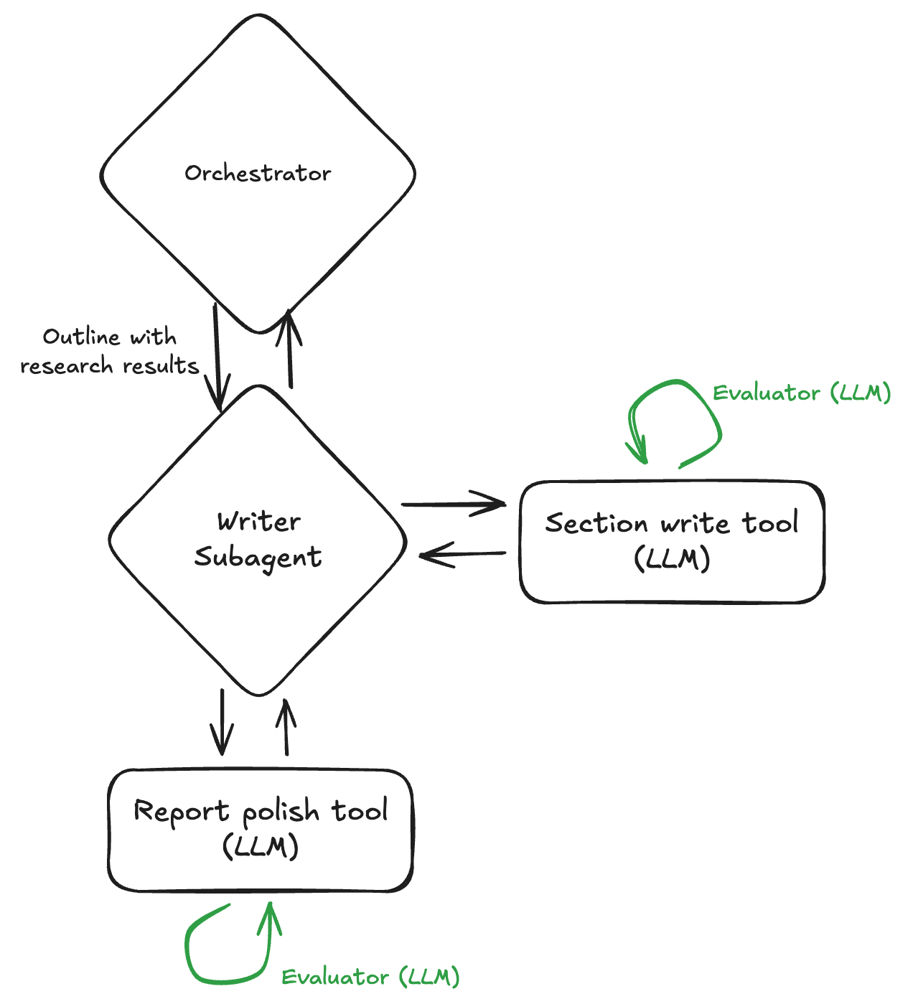

## Writer Subagent 아키텍처 및 Flow

### 개요



Writer Subagent는 **Orchestrator로부터 아웃라인과 리서치 결과(Outline with research results)를 입력으로 받아**, 실제 리포트 콘텐츠를 작성하는 서브에이전트입니다. 단순히 정보를 나열하는 것이 아니라, **Section write tool로 각 섹션을 작성한 후 Report polish tool로 최종 리포트를 다듬는** 두 단계 구조를 가집니다.

이 서브에이전트의 핵심 특징은 **각 도구(tool)에 내장된 Evaluator(LLM) 기반 품질 검증 루프**를 통해 고품질의 일관된 리포트를 생성한다는 점입니다.

---

### 처리 단계

#### Step 1: 아웃라인 및 리서치 결과 수신

Orchestrator로부터 **아웃라인과 리서치 결과(Outline with research results)**를 입력받습니다. 이 입력에는 리포트의 전체 구조(아웃라인)와 각 섹션에 필요한 수집된 정보(스니펫 + 웹페이지 콘텐츠)가 포함됩니다.

입력 형태 예시:
- 아웃라인: 리포트 전체 섹션 구조 및 각 섹션 description
- 리서치 결과: 각 섹션에 매핑된 수집된 정보 (스니펫들, 콘텐츠들)

#### Step 2: Section write tool로 섹션 작성

Writer Subagent는 **Section write tool(LLM)**을 호출하여 아웃라인과 리서치 결과를 바탕으로 각 섹션의 콘텐츠를 작성합니다. 이 도구 내부에는 **Evaluator(LLM) 셀프 루프**가 존재하여, 작성된 섹션의 품질이 기준에 미달하면 자체적으로 재작성을 반복합니다.

작성 시 고려사항:
- 수집된 정보를 자연스럽게 통합
- 출처 인용 처리
- 섹션 description에서 요구하는 내용 커버
- 적절한 분량과 깊이

#### Step 3: Report polish tool로 최종 리포트 완성

섹션 작성이 완료되면, Writer Subagent는 **Report polish tool(LLM)**을 호출하여 전체 리포트를 통합하고 다듬습니다. 이 도구 내부에도 **Evaluator(LLM) 셀프 루프**가 존재하여, 완성된 리포트의 품질이 기준에 미달하면 자체적으로 재polish를 반복합니다.

polish 단계에서 처리되는 항목:
- 섹션 간 연결 문구 추가
- 서론/결론 작성 및 조정
- 전체 문체 일관성 확보
- 논리적 흐름 조정

---

### 두 가지 Evaluator 셀프 루프

Writer Subagent가 호출하는 각 도구는 **자체적인 Evaluator(LLM) 셀프 루프**를 내장하고 있습니다. Evaluator는 별도의 독립 컴포넌트가 아니라 각 도구 내부에서 동작하는 LLM 기반 평가 루프입니다.

#### Loop 1: Section write tool 내부 Evaluator 루프

Section write tool이 섹션을 작성한 후, **도구 내부의 Evaluator(LLM)**가 품질을 평가하고 미달 시 재작성을 반복합니다.

```
Outline with research results
    ↓
Section write tool (LLM)
    ↓
섹션 콘텐츠 작성
    ↓
Evaluator (LLM) 평가  ←──────────────┐
    ↓                                │
실패: 피드백 반영하여 재작성 ──────────┘
    ↓ (통과)
섹션 작성 완료
```

Evaluator 평가 항목 예시 (섹션 레벨):
- 수집된 정보가 충분히 활용되었는가
- 섹션 description에서 요구한 내용이 모두 커버되었는가
- 문단 구성이 논리적인가
- 출처 인용이 적절한가
- 분량이 적절한가 (너무 짧거나 길지 않은가)

#### Loop 2: Report polish tool 내부 Evaluator 루프

Report polish tool이 리포트를 통합/다듬은 후, **도구 내부의 Evaluator(LLM)**가 전체 품질을 평가하고 미달 시 재polish를 반복합니다.

```
섹션 작성 완료
    ↓
Report polish tool (LLM)
    ↓
리포트 통합 및 polish
    ↓
Evaluator (LLM) 평가  ←──────────────────────────────┐
    ↓                                                │
실패: 피드백 반영하여 리포트 재수정 ─────────────────┘
    ↓ (통과)
Final Report 완성
```

Evaluator 평가 항목 예시 (리포트 레벨):
- 섹션 간 문체 일관성이 유지되는가
- 전체적인 논리적 흐름이 자연스러운가
- 섹션 간 연결이 매끄러운가
- 서론이 전체 내용을 적절히 소개하는가
- 결론이 본문 내용을 잘 요약하는가
- 중복되는 내용이 없는가
- 전체 톤앤매너가 일관되는가

#### 전체 흐름 요약

```
Orchestrator
    │
    │  Outline with research results
    ▼
Writer Subagent
    │
    ▼
Section write tool (LLM)
    │  [Evaluator (LLM) 셀프 루프]
    ▼
Report polish tool (LLM)
    │  [Evaluator (LLM) 셀프 루프]
    ▼
Final Report
```

---

### 종료 조건

다음 조건을 만족하면 리포트 작성을 완료합니다:

1. **Section write tool 내부 Evaluator**가 섹션 품질 통과 판정
2. **Report polish tool 내부 Evaluator**가 전체 리포트 품질 통과 판정
3. 또는, 각 루프의 최대 반복 횟수 도달 (graceful degradation)

---

### 구현 시 핵심 컴포넌트

1. **Writer Subagent**: Orchestrator로부터 Outline with research results를 받아 Section write tool과 Report polish tool을 순서대로 호출하며 전체 흐름을 제어
2. **Section write tool (LLM)**: 아웃라인과 리서치 결과를 받아 각 섹션의 콘텐츠를 작성하는 도구. 내부에 Evaluator(LLM) 셀프 루프를 내장
3. **Report polish tool (LLM)**: 작성된 섹션들을 통합하고 전체 리포트를 다듬는 도구. 내부에 Evaluator(LLM) 셀프 루프를 내장
4. **Evaluator (LLM)**: 각 도구 내부에 존재하는 셀프 루프 평가자. 독립 컴포넌트가 아닌 각 도구의 일부로 동작

---

### 세 Agent 비교

| 구분 | Outliner Agent | Researcher Agent | Writer Subagent |
|------|----------------|------------------|-----------------|
| 입력 | 사용자 주제/질문 | 아웃라인 | Outline with research results |
| 출력 | 구조화된 아웃라인 | 섹션별 수집된 정보 | 완성된 리포트 |
| 처리 단위 | 단일 파이프라인 | 섹션별 병렬 파이프라인 | Section write tool → Report polish tool |
| Evaluator 위치 | 아웃라인 생성 후 | 필요 정보 정의 + 파이프라인 내부 | 각 도구 내부 셀프 루프 |
| 평가 대상 | 아웃라인 구조/품질 | 정보 충분성 | 콘텐츠 품질 + 문체 일관성 |
